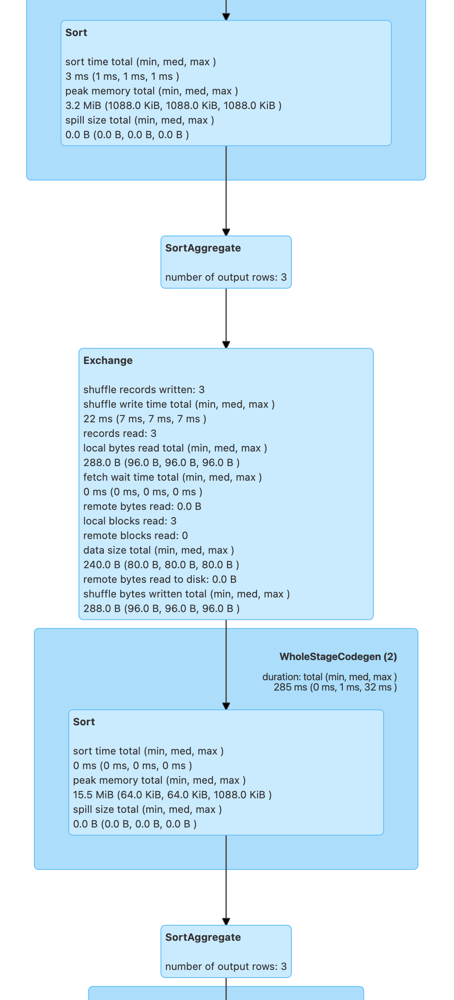

# SortBasedAggregationIterator

`SortBasedAggregationIterator` is an [AggregationIterator](AggregationIterator.md) that is used by [SortAggregateExec](../physical-operators/SortAggregateExec.md) physical operator to [process rows](#processInputs) in a partition.

## Creating Instance

`SortBasedAggregationIterator` takes the following to be created:

* <span id="partIndex"> Partition ID
* <span id="groupingExpressions"> Grouping [NamedExpression](../expressions/NamedExpression.md)s
* <span id="valueAttributes"> Value [Attribute](../expressions/Attribute.md)s
* <span id="inputIterator"> Input Iterator ([InternalRow](../InternalRow.md)s)
* <span id="aggregateExpressions"> [AggregateExpression](../expressions/AggregateExpression.md)s
* <span id="aggregateAttributes"> Aggregate [Attribute](../expressions/Attribute.md)s
* <span id="initialInputBufferOffset"> Initial input buffer offset
* <span id="resultExpressions"> Result [NamedExpression](../expressions/NamedExpression.md)s
* <span id="newMutableProjection"> Function to create a new `MutableProjection` given expressions and attributes (`(Seq[Expression], Seq[Attribute]) => MutableProjection`)
* [number of output rows](#numOutputRows) metric

`SortBasedAggregationIterator` [initializes](#initialize) immediately.

`SortBasedAggregationIterator` is created when:

* `SortAggregateExec` physical operator is requested to [doExecute](../physical-operators/SortAggregateExec.md#doExecute)

### Initialization { #initialize }

```scala
initialize(): Unit
```

??? warning "Procedure"
    `initialize` is a procedure (returns `Unit`) so _what happens inside stays inside_ (paraphrasing the [former advertising slogan of Las Vegas, Nevada](https://idioms.thefreedictionary.com/what+happens+in+Vegas+stays+in+Vegas)).

`initialize`...FIXME

## Performance Metrics { #metrics }

`SortBasedAggregationIterator` is given the [performance metrics](../SQLMetric.md) of the owning [SortAggregateExec](../physical-operators/SortAggregateExec.md#metrics) aggregate physical operator when [created](#creating-instance).

The metrics are displayed as part of [SortAggregateExec](../physical-operators/SortAggregateExec.md) aggregate physical operator (e.g. in web UI in [Details for Query](../ui/SQLTab.md#ExecutionPage)).



### number of output rows { #numOutputRows }

`SortBasedAggregationIterator` is given **number of output rows** [performance metric](../SQLMetric.md) when [created](#creating-instance).

The metric is [number of output rows](../physical-operators/HashAggregateExec.md#numOutputRows) metric of the owning [SortAggregateExec](../physical-operators/SortAggregateExec.md) physical operator.

The metric is incremented every time `SortBasedAggregationIterator` is requested for [next element](#next) (and there's one).

## Aggregation Buffer { #sortBasedAggregationBuffer }

```scala
sortBasedAggregationBuffer: InternalRow
```

`SortBasedAggregationIterator` [creates a new buffer](#newBuffer) for aggregation (called `sortBasedAggregationBuffer`) when [created](#creating-instance).

`sortBasedAggregationBuffer` is an [InternalRow](../InternalRow.md) used when `SortBasedAggregationIterator` is requested for the following:

* [Initializing](#initialize) to [initialize the buffer](AggregationIterator.md#initializeBuffer) when there are input rows in the [input iterator](#inputIterator)
* [processCurrentSortedGroup](#processCurrentSortedGroup) using the [Process Row Function](AggregationIterator.md#processRow) (with the [firstRowInNextGroup](#firstRowInNextGroup) and then all the rows in a group per [currentGroupingKey](#currentGroupingKey))
* [next](#next) (after [processCurrentSortedGroup](#processCurrentSortedGroup)) to generate next element (a sort aggregate result) using the [Generate Output Function](AggregationIterator.md#generateOutput) followed by [initializing the buffer](AggregationIterator.md#initializeBuffer)
* [outputForEmptyGroupingKeyWithoutInput](#outputForEmptyGroupingKeyWithoutInput) (to [initialize the buffer](AggregationIterator.md#initializeBuffer) followed by generating the only sort aggregate result using the [Generate Output Function](AggregationIterator.md#generateOutput))

### Creating New Buffer { #newBuffer }

```scala
newBuffer: InternalRow
```

`newBuffer` creates a new aggregation buffer (an [InternalRow](../InternalRow.md)) and [initializes buffer values](AggregationIterator.md#initializeBuffer) for all [imperative aggregate functions](AggregationIterator.md#allImperativeAggregateFunctions) (using their [aggBufferAttributes](../expressions/AggregateFunction.md#aggBufferAttributes))

## Checking for Next Row Available { #hasNext }

??? note "Iterator"

    ```scala
    hasNext: Boolean
    ```

    `hasNext` is part of the `Iterator` ([Scala]({{ scala.api }}/scala/collection/Iterator.html#hasNext:Boolean)) abstraction.

`hasNext` is the [sortedInputHasNewGroup](#sortedInputHasNewGroup).

### sortedInputHasNewGroup { #sortedInputHasNewGroup }

```scala
var sortedInputHasNewGroup: Boolean = false
```

`SortBasedAggregationIterator` defines `sortedInputHasNewGroup` flag for [hasNext](#hasNext).

`sortedInputHasNewGroup` indicates that there are no input rows or the current group is the last in the [inputIterator](#inputIterator).

`sortedInputHasNewGroup` flag is enabled (`true`) when the [inputIterator](#inputIterator) has rows (is not empty) when [initialize](#initialize).

`sortedInputHasNewGroup` flag is disabled (`false`) when `SortBasedAggregationIterator` is requested for the following:

* [initialize](#initialize) and there are no rows in the [inputIterator](#inputIterator)
* There are no more groups in the [inputIterator](#inputIterator) while [processCurrentSortedGroup](#processCurrentSortedGroup)

## Next Row { #next }

??? note "Iterator"

    ```scala
    next(): UnsafeRow
    ```

    `next` is part of the `Iterator` ([Scala]({{ scala.api }}/scala/collection/Iterator.html#next():A)) abstraction.

`next`  if [there is an input row available](#hasNext) or throws an `NoSuchElementException`.

---

If [there is an input row available](#hasNext), `next` does the following:

1. [Processes the current (sorted) group](#processCurrentSortedGroup)
1. Generates output aggregate result for the current group using the [Generate Output Function](AggregationIterator.md#generateOutput) for the [currentGroupingKey](#currentGroupingKey) and the [aggregation buffer](#sortBasedAggregationBuffer)
1. [Initializes the buffer](#initializeBuffer) for values of the next group (with the [aggregation buffer](#sortBasedAggregationBuffer))
1. Increments the [number of output rows](#numOutputRows) metric

In the end, `next` returns the generated output row.

### Processing Current Sorted Group { #processCurrentSortedGroup }

```scala
processCurrentSortedGroup(): Unit
```

`processCurrentSortedGroup`...FIXME

## Current Grouping Key { #currentGroupingKey }

```scala
var currentGroupingKey: UnsafeRow
```

`currentGroupingKey` is an [UnsafeRow](../UnsafeRow.md) that is the value of the grouping key of the aggregation [being processed](#processCurrentSortedGroup).

In other words, `SortBasedAggregationIterator` uses the `currentGroupingKey` to [process the current sorted group](#processCurrentSortedGroup) fully (using the [Process Row Function](AggregationIterator.md#processRow)) until the [groupingProjection](AggregationIterator.md#groupingProjection) generates a [next grouping key](#nextGroupingKey) for an input row.

`currentGroupingKey` is initialized as the [next grouping key](#nextGroupingKey) at the beginning of [processing the current sorted group](#processCurrentSortedGroup) (and remains so until there are more rows for the current aggregation group).

## Next Grouping Key { #nextGroupingKey }

```scala
var nextGroupingKey: UnsafeRow
```

`nextGroupingKey` is an [UnsafeRow](../UnsafeRow.md) that is the value of the next grouping key (based on the [groupingProjection](#groupingProjection)).

`nextGroupingKey` is the result of executing the [groupingProjection](#groupingProjection) on the current row, if available, that happens when `SortBasedAggregationIterator`  is requested for the following:

* [Initialization](#initialize) (when [created](#creating-instance))
* [Processing Current Sorted Group](#processCurrentSortedGroup)

As long as `nextGroupingKey` is within the same group (based on the [groupingProjection](#groupingProjection)) while [processing current sorted group](#processCurrentSortedGroup), `SortBasedAggregationIterator` keeps processesing input rows (using the [Process Row Function](AggregationIterator.md#processRow)) that are assumed to be within the same aggregate group.

`nextGroupingKey` becomes the [Current Grouping Key](#currentGroupingKey) at the beginning of [processing the current sorted group](#processCurrentSortedGroup).
