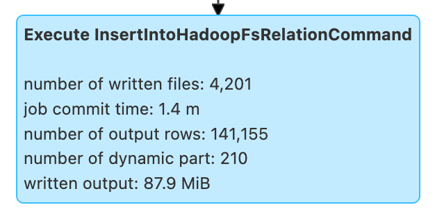

# DataWritingCommand Logical Commands

`DataWritingCommand` is an [extension](#contract) of the `UnaryCommand` abstraction for [logical commands](#implementations) that write the result of executing [query](#query) (_query data_) to a relation (when [executed](#run)).

## Contract

### <span id="outputColumnNames"> Output Column Names

```scala
outputColumnNames: Seq[String]
```

The names of the output columns of the [analyzed input query plan](#query)

Used when:

* `DataWritingCommand` is requested for the [output columns](#outputColumns)

### <span id="query"> Query

```scala
query: LogicalPlan
```

The analyzed [LogicalPlan](LogicalPlan.md) representing the data to write (i.e. whose result will be inserted into a relation)

Used when:

* [BasicOperators](../execution-planning-strategies/BasicOperators.md) execution planning strategy is executed
* `DataWritingCommand` is requested for the [child logical operator](#child) and the [output columns](#outputColumns)

### <span id="run"> Executing

```scala
run(
  sparkSession: SparkSession,
  child: SparkPlan): Seq[Row]
```

Used when:

* `CreateHiveTableAsSelectBase` is requested to `run`
* [DataWritingCommandExec](../physical-operators/DataWritingCommandExec.md) physical operator is requested for the [sideEffectResult](../physical-operators/DataWritingCommandExec.md#sideEffectResult)

## Implementations

* [CreateDataSourceTableAsSelectCommand](CreateDataSourceTableAsSelectCommand.md)
* `CreateHiveTableAsSelectBase`
* [InsertIntoHadoopFsRelationCommand](InsertIntoHadoopFsRelationCommand.md)
* [SaveAsHiveFile](../hive/SaveAsHiveFile.md)

## <span id="metrics"> Performance Metrics



### <span id="jobCommitTime"> job commit time

### <span id="numParts"> number of dynamic part

[Number of partitions](../connectors/BasicWriteTaskStats.md#partitions) (when [processing write job statistics](../connectors/BasicWriteJobStatsTracker.md#processStats))

Corresponds to the number of times when [newPartition](../connectors/BasicWriteTaskStatsTracker.md#newPartition) of [BasicWriteTaskStatsTracker](../connectors/BasicWriteTaskStatsTracker.md) was called (that is to announce the fact that a new partition is about to be written)

### <span id="numOutputRows"> number of output rows

### <span id="numFiles"> number of written files

### <span id="taskCommitTime"> task commit time

### <span id="numOutputBytes"> written output

## Execution Planning

`DataWritingCommand` is resolved to a [DataWritingCommandExec](../physical-operators/DataWritingCommandExec.md) physical operator by [BasicOperators](../execution-planning-strategies/BasicOperators.md) execution planning strategy.

## <span id="basicWriteJobStatsTracker"> BasicWriteJobStatsTracker

```scala
basicWriteJobStatsTracker(
  hadoopConf: Configuration): BasicWriteJobStatsTracker
```

`basicWriteJobStatsTracker` creates a new [BasicWriteJobStatsTracker](../connectors/BasicWriteJobStatsTracker.md) (with the given Hadoop [Configuration]({{ hadoop.api }}/org/apache/hadoop/conf/Configuration.html) and the [metrics](#metrics)).

`basicWriteJobStatsTracker` is used when:

* [InsertIntoHadoopFsRelationCommand](InsertIntoHadoopFsRelationCommand.md) logical command is executed
* [SaveAsHiveFile](../hive/SaveAsHiveFile.md) logical command is executed (and requested to [saveAsHiveFile](../hive/SaveAsHiveFile.md#saveAsHiveFile))
