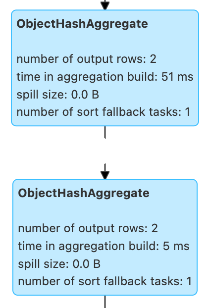

# ObjectHashAggregateExec Aggregate Physical Operator

`ObjectHashAggregateExec` is an [aggregate unary physical operator](BaseAggregateExec.md) for **object aggregation**.

`ObjectHashAggregateExec` uses [ObjectAggregationIterator](ObjectAggregationIterator.md) for [aggregation](#doExecute) (one per partition).



## Creating Instance

`ObjectHashAggregateExec` takes the following to be created:

* <span id="requiredChildDistributionExpressions"> Required Child Distribution [Expression](../expressions/Expression.md)s
* [isStreaming](#isStreaming) flag
* <span id="numShufflePartitions"> Number of Shuffle Partitions (always `None`)
* <span id="groupingExpressions"> Grouping [NamedExpression](../expressions/NamedExpression.md)s
* <span id="aggregateExpressions"> [AggregateExpression](../expressions/AggregateExpression.md)s
* <span id="aggregateAttributes"> Aggregate [Attribute](../expressions/Attribute.md)s
* <span id="initialInputBufferOffset"> Initial Input Buffer Offset
* <span id="resultExpressions"> Result [NamedExpression](../expressions/NamedExpression.md)s
* <span id="child"> Child [Physical Operator](SparkPlan.md)

`ObjectHashAggregateExec` is created when:

* `AggUtils` is requested to [create a physical operator for aggregation](../AggUtils.md#createAggregate)

### <span id="isStreaming"> isStreaming Flag

`ObjectHashAggregateExec` is given `isStreaming` flag when [created](#creating-instance).

The `isStreaming` is always `false` but when `AggUtils` is requested to [create a streaming aggregate physical operator](../AggUtils.md#createStreamingAggregate).

## <span id="metrics"> Performance Metrics

### <span id="aggTime"> time in aggregation build

The time to [doExecute](#doExecute) of a single partition.

### <span id="numOutputRows"> number of output rows

* `1` when there is no input rows in a partition and no [groupingExpressions](#groupingExpressions).
* Used to create an [ObjectAggregationIterator](ObjectAggregationIterator.md#numOutputRows).

### <span id="numTasksFallBacked"> number of sort fallback tasks

Used to create a [ObjectAggregationIterator](ObjectAggregationIterator.md#numTasksFallBacked).

### <span id="spillSize"> spill size

Used to create a [ObjectAggregationIterator](ObjectAggregationIterator.md#spillSize).

## <span id="doExecute"> Executing Physical Operator

```scala
doExecute(): RDD[InternalRow]
```

`doExecute` is part of the [SparkPlan](SparkPlan.md#doExecute) abstraction.

---

`doExecute` requests the [child physical operator](#child) to [execute](SparkPlan.md#execute) (and generate an `RDD[InternalRow]`) that is `mapPartitionsWithIndexInternal` to process partitions.

!!! note
    `doExecute` adds a new `MapPartitionsRDD` ([Spark Core]({{ book.spark_core }}/rdd/MapPartitionsRDD)) to the RDD lineage.

For no input records (in a partition) and non-empty [groupingExpressions](#groupingExpressions), `doExecute` returns an empty `Iterator`.

Otherwise, `doExecute` creates a [ObjectAggregationIterator](ObjectAggregationIterator.md).

For no input records (in a partition) and no [groupingExpressions](#groupingExpressions), `doExecute` increments the [numOutputRows](#numOutputRows) metric (so it's just `1`) and requests the `ObjectAggregationIterator` for [outputForEmptyGroupingKeyWithoutInput](ObjectAggregationIterator.md#outputForEmptyGroupingKeyWithoutInput).

Otherwise, `doExecute` returns the `ObjectAggregationIterator`.

## <span id="supportsAggregate"> Selection Requirements

```scala
supportsAggregate(
  aggregateExpressions: Seq[AggregateExpression]): Boolean
```

`supportsAggregate` is enabled (`true`) when there is a `TypedImperativeAggregate` aggregate function among the [AggregateFunction](../expressions/AggregateFunction.md)s of the given [AggregateExpression](../expressions/AggregateExpression.md)s.

---

`supportsAggregate` is used when:

* `AggUtils` utility is used to [select an aggregate physical operator](../AggUtils.md#createAggregate)

## Demo

`ObjectHashAggregateExec` is selected when [spark.sql.execution.useObjectHashAggregateExec](../configuration-properties.md#spark.sql.execution.useObjectHashAggregateExec) configuration property is enabled (and [HashAggregateExec](HashAggregateExec.md) could not be used).

```scala
assert(spark.sessionState.conf.useObjectHashAggregation)
```

Use [immutable](../UnsafeRow.md#isMutable) data types for `aggregateBufferAttributes`.

```scala
val dataset = Seq(
  (0, Seq.empty[Int]),
  (1, Seq(1, 1)),
  (2, Seq(2, 2))).toDF("id", "nums")
```

```scala
import org.apache.spark.sql.functions.size
val q = dataset.
  groupBy(size($"nums") as "group"). // <-- size over array
  agg(collect_list("id") as "ids")
```

```text
scala> q.explain
== Physical Plan ==
ObjectHashAggregate(keys=[size(nums#8, true)#18], functions=[collect_list(id#7, 0, 0)])
+- Exchange hashpartitioning(size(nums#8, true)#18, 200), ENSURE_REQUIREMENTS, [id=#10]
   +- ObjectHashAggregate(keys=[size(nums#8, true) AS size(nums#8, true)#18], functions=[partial_collect_list(id#7, 0, 0)])
      +- LocalTableScan [id#7, nums#8]
```

```text
scala> println(q.queryExecution.sparkPlan.numberedTreeString)
00 ObjectHashAggregate(keys=[size(nums#8, true)#18], functions=[collect_list(id#7, 0, 0)], output=[group#11, ids#15])
01 +- ObjectHashAggregate(keys=[size(nums#8, true) AS size(nums#8, true)#18], functions=[partial_collect_list(id#7, 0, 0)], output=[size(nums#8, true)#18, buf#20])
02    +- LocalTableScan [id#7, nums#8]
```

Going low level. Watch your steps :)

```text
// copied from HashAggregateExec as it is the preferred aggreate physical operator
// and HashAggregateExec is checked first
// When the check fails, ObjectHashAggregateExec is then checked
import q.queryExecution.optimizedPlan
import org.apache.spark.sql.catalyst.plans.logical.Aggregate
val aggLog = optimizedPlan.asInstanceOf[Aggregate]
import org.apache.spark.sql.catalyst.planning.PhysicalAggregation
import org.apache.spark.sql.catalyst.expressions.aggregate.AggregateExpression
// groupingExpressions, aggregateExpressions, resultExpressions, child
val (_, aggregateExpressions: Seq[AggregateExpression], _, _) = PhysicalAggregation.unapply(aggLog).get
val aggregateBufferAttributes =
  aggregateExpressions.flatMap(_.aggregateFunction.aggBufferAttributes)
```

One of the reasons why `ObjectHashAggregateExec` was selected is that `HashAggregateExec` did not meet the requirements.

```scala
import org.apache.spark.sql.execution.aggregate.HashAggregateExec
assert(HashAggregateExec.supportsAggregate(aggregateBufferAttributes) == false)
```

```scala
// collect_list aggregate function uses CollectList TypedImperativeAggregate under the covers
import org.apache.spark.sql.execution.aggregate.ObjectHashAggregateExec
assert(ObjectHashAggregateExec.supportsAggregate(aggregateExpressions))
```

```scala
val aggExec = q.queryExecution.sparkPlan.children.head.asInstanceOf[ObjectHashAggregateExec]
```

```text
scala> println(aggExec.aggregateExpressions.head.numberedTreeString)
00 partial_collect_list(id#7, 0, 0)
01 +- collect_list(id#7, 0, 0)
02    +- id#7: int
```
